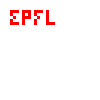

# BUG-1
## Category
Iteration error

## Description
in original code, the width of produced EPFL is set to 15 column because of the iteration forgot to multiply `logo_width` by `size`, so we can't successfully produce the logo we want.

## Affected Lines in the original program
`epfl.c:76`

## Expected vs Observed
### expected
full EPFL logo
### observed
partial EPFL logo


## Steps to Reproduce
Assume we have a solid.png with size 100 * 100. We want to draw a EPFL logo with size 3.
```shell
./epfl solid.png solid_epfl.png 10 10 3 fe0002
```

### Proof-of-Concept Input (if needed)
/pictures/solid.png

## Suggested Fix Description
Multiply logo_width by size, to allow enough width length:
```c
 if (j >= top_left_x && j < top_left_x + logo_width * size) { //forgot *size
      // Find column index in logo
      unsigned j_logo = (j - top_left_x) / size;
      // Ensure that we do not go below the bottom of the picture
      if (i + size * logo_height >= height) {
        // If we do, move the logo up to the top.
        epfl[j_logo] += logo_adj[j_logo];
        i = logo_adj[j_logo] = 0;
      }
      ...
```

### current output
