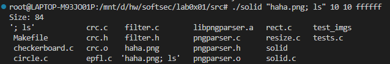
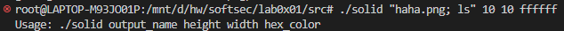

# BUG-3
## Category
command injection

## Discription
Because this code doesnot validate the input parameter `argv[1]`, use of the `system()` function can result in exploitable vulnerabilities. Because shell allows multiple command through `;`. The attacker can perform malicious actions on the machine.

## Steps to Reproduce

We actually can excute arbitary command through this code.

## Suggested Fix Description
Check in the beginnig of the program that we do input a valid filename.
```c
  /*avoid command injection*/
  for (int i = 0; i < strlen(output_name); i++) {
    if (output_name[i] == ' ' || output_name[i] == ';' || output_name[i] == ':') {
      goto error;
    }
  }
```
Because we sanitize `';'`, the chance of being injected by multiple command is reduced.

## current output
Now when we try to inject the host, it won't succeed.

